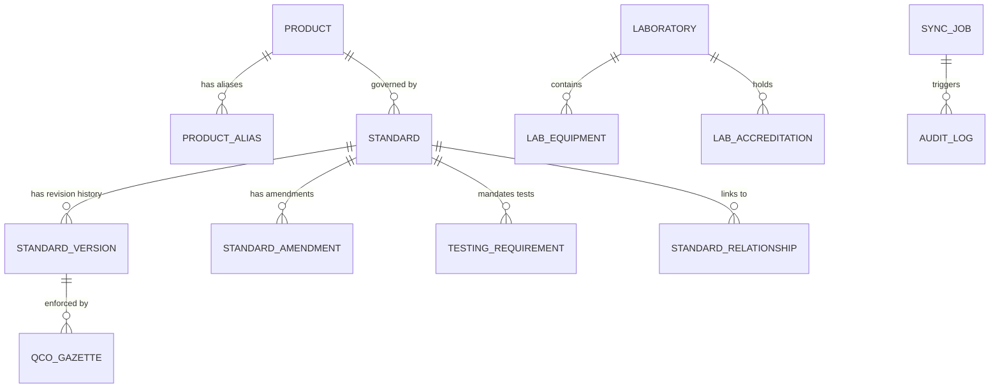

# NexaStandards — Data Model & Database Architecture

**SIH 2026 Problem Statement**: SIH26107 — AI-powered Intelligent Assistant for Indian Standards and BIS Services  
**ORM Framework**: SQLAlchemy 2.0  
**Storage Engine**: SQLite (Development / Demo) / PostgreSQL (Production)  

---

## 1. Schema Overview

The database model is designed to represent complex statutory hierarchies, standard revisions, Quality Control Orders, testing matrices, accredited laboratories, and immutable audit trails.

---

## 2. Core Entity Models

### 2.1 ProductModel (`products`)
Represents manufactured consumer or industrial goods subject to BIS jurisdiction.
- `id` (VARCHAR PK): Unique product slug (e.g., `prod_mobile_phone`, `prod_pressure_cooker`).
- `name` (VARCHAR): Canonical product name (e.g., "Mobile Phone", "Domestic Pressure Cooker").
- `category` (VARCHAR): Industrial sector (e.g., "Electronics & IT Goods", "Cookware & Utensils").
- `description` (TEXT): Statutory scope and functional definition.
- `created_at`, `updated_at` (DATETIME).

### 2.2 ProductAliasModel (`product_aliases`)
Maps user colloquialisms, abbreviations, and Indian language terms to canonical products.
- `id` (VARCHAR PK)
- `product_id` (VARCHAR FK -> `products.id`)
- `alias` (VARCHAR): Lowercase search term (e.g., "cell phone", "smartphone", "mobile", "handset", "dabba", "cooker", "bottle").
- `language` (VARCHAR): Language code (`en`, `hi`, `kn`, etc.).

### 2.3 StandardModel (`standards`)
Represents the core Indian Standard specification.
- `id` (VARCHAR PK): Primary identifier (e.g., `IS_13252`, `IS_2347`).
- `standard_number` (VARCHAR): Official format code (e.g., `IS 13252 (Part 1):2010`).
- `title` (VARCHAR): Official gazetted title.
- `scope` (TEXT): Technical and material scope.
- `is_mandatory` (BOOLEAN): Whether certification is legally compulsory under a QCO.
- `scheme_type` (VARCHAR): `Scheme I (ISI Mark)`, `Scheme II (CRS)`, `Scheme IV (Hallmarking)`.
- `status` (VARCHAR): `CURRENT`, `SUPERSEDED`, `WITHDRAWN`, `UPCOMING`.
- `revision_year` (VARCHAR): Year of current operative revision.

### 2.4 StandardVersionModel (`standard_versions`)
Preserves complete chronological evolution of standards for Requirement 51.
- `id` (VARCHAR PK): e.g., `ver_13252_2010`, `ver_13252_2003`, `ver_62368_2023`.
- `standard_number` (VARCHAR): Exact version code with year.
- `base_standard_code` (VARCHAR): Base standard series (e.g., `IS 13252`).
- `version_year` (VARCHAR): 4-digit edition year.
- `title` (VARCHAR): Title of this specific edition.
- `status` (VARCHAR): `ACTIVE`, `SUPERSEDED`, `UPCOMING`, `WITHDRAWN`.
- `user_status_label` (VARCHAR): Human-readable indicator.
- `publication_date` (VARCHAR): Gazette notification date.
- `effective_date` (VARCHAR): Statutory enforcement date.
- `withdrawal_date` (VARCHAR, Nullable): Date previous standard ceased being acceptable.
- `supersedes` (VARCHAR, Nullable): Pointer to superseded previous edition.
- `superseded_by` (VARCHAR, Nullable): Pointer to newer superseding revision.
- `amendment_numbers` (VARCHAR, Nullable): CSV of published amendments.
- `source_url` (VARCHAR): Link to authoritative BIS gazette file.
- `verified_at` (DATETIME): Timestamp of last registry confirmation.

### 2.5 StandardAmendmentModel (`standard_amendments`)
Tracks operative amendments and transitional timelines.
- `id` (VARCHAR PK)
- `standard_number` (VARCHAR): Target standard.
- `amendment_no` (VARCHAR): e.g., `Amendment 1`, `Amendment 2`.
- `title` (VARCHAR): Scope of modification.
- `publication_date` (VARCHAR)
- `effective_date` (VARCHAR)
- `key_changes` (TEXT): Clause-by-clause summary of changes.
- `clause_affected` (VARCHAR)

### 2.6 QCOGazetteModel (`qco_gazette_orders`)
Stores central government Quality Control Orders issued under Section 16 of the BIS Act, 2016.
- `id` (VARCHAR PK)
- `order_number` (VARCHAR): Official Gazette number (e.g., `S.O. 1294(E)`).
- `title` (VARCHAR): Full statutory title of the order.
- `ministry` (VARCHAR): Issuing Ministry (e.g., `DPIIT`, `MeitY`, `Ministry of Steel`).
- `date_of_notification` (VARCHAR)
- `effective_date` (VARCHAR)
- `status` (VARCHAR): `CURRENT`, `SUPERSEDED`, `AMENDED`.
- `supersedes_order` (VARCHAR, Nullable)
- `affected_standards` (VARCHAR): Standards brought under mandatory certification.
- `mandatory_scheme` (VARCHAR): Required certification scheme.
- `has_supersession_notice` (BOOLEAN)

### 2.7 TestingRequirementModel (`testing_requirements`)
Clause-by-clause testing parameters for laboratories and conformity audits.
- `id` (VARCHAR PK)
- `standard_id` (VARCHAR FK -> `standards.id`)
- `clause_number` (VARCHAR): e.g., `Clause 4.1`, `Clause 5.3`.
- `test_name` (VARCHAR): e.g., "Hydrostatic Burst Pressure Test", "Lead Leaching Test".
- `parameter` (VARCHAR): Physical or chemical property evaluated.
- `limit_specification` (TEXT): Acceptable threshold under Indian law.
- `test_type` (VARCHAR): `DESTRUCTIVE`, `NON_DESTRUCTIVE`, `ELECTRICAL`, `CHEMICAL`.

### 2.8 LaboratoryModel (`laboratories`)
BIS-recognized and NABL-accredited testing facilities.
- `id` (VARCHAR PK)
- `name` (VARCHAR): Facility name.
- `city` (VARCHAR)
- `state` (VARCHAR)
- `address` (TEXT)
- `contact_email`, `contact_phone` (VARCHAR)
- `accreditation_number` (VARCHAR): NABL Certificate ID.
- `is_bis_recognized` (BOOLEAN)

### 2.9 SyncJobModel (`sync_jobs`) & SourceDocumentModel (`source_documents`)
Infrastructure for automated synchronization, official metadata tracking, and offline resilience without PDF hashing.
- **SourceDocumentModel**:
  - `id`: Unique record ID.
  - `source_url`: Authoritative BIS / Ministry portal URL.
  - `document_title`: Gazetted / published title.
  - `document_type`: `INDIAN_STANDARD`, `STANDARD_REVISION`, `AMENDMENT`, `CORRIGENDUM`, `QCO`, `QCO_AMENDMENT`, `GAZETTE_NOTIFICATION`.
  - `standard_number`: Official standard designation (e.g., `IS 13252 (Part 1):2010`).
  - `standard_year`: 4-digit edition year as officially published.
  - `amendment_number`: Official amendment indicator (e.g., `Amendment 1`).
  - `gazette_notification_number`: Official S.O./G.S.R. number.
  - `publication_date`: Official publication date.
  - `effective_date`: Legal enforcement date.
  - `withdrawal_date`: Withdrawal date if applicable.
  - `supersedes`, `superseded_by`: Statutory lineage pointers.
  - `last_checked`: UTC timestamp of latest check.
  - `status`: `ACTIVE`, `UPCOMING`, `SUPERSEDED`, `WITHDRAWN`, `UPDATE_REVIEW_REQUIRED`, `SOURCE_UNAVAILABLE`.
  - `review_notes`: Reason if `UPDATE_REVIEW_REQUIRED`.
- **SyncJobModel**:
  - `source_name`, `source_url`: Source coordinates.
  - `last_checked`: UTC timestamp.
  - `last_official_update`: Title/citation of latest official regulatory update.
  - `records_updated`: Count of updated records.
  - `status`: `SUCCESS`, `SOURCE_UNAVAILABLE`, `UPDATE_REVIEW_REQUIRED`.
  - `error_message`: Error details if unreachable or degraded.

### 2.10 AuditLogModel (`audit_logs`)
Immutable ledger of statutory changes, supersessions, and administrative events.
- `action`: `STANDARD_REVISED`, `QCO_NOTIFIED`, `AMENDMENT_APPLIED`.
- `intent`: Trigger context.
- `details`: Detailed changelog.
- `timestamp`: UTC timestamp.
